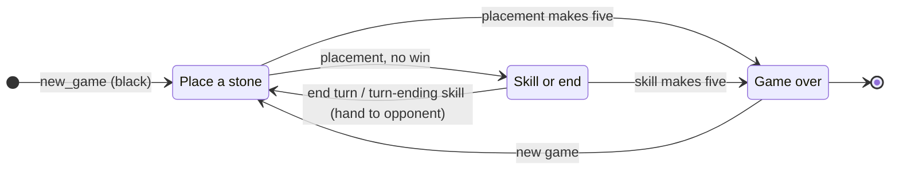

**CID**: [02607506]

# Chaos Gomoku

Five-in-a-row on a 15×15 board, with chaotic special skills. A turn-based,
strategy-heavy board game for one human (black) against a computer opponent
(white), or two humans sharing one device. The whole game is written as one
pure, immutable module with a thin DOM controller on top, and every source and
test file passes JSLint with zero warnings.

* **Game module:** [`web-app/ChaosGomoku.js`](web-app/ChaosGomoku.js) — all
  rules, pure and immutable.
* **Computer opponent:** [`web-app/ai.js`](web-app/ai.js) — a pure move chooser.
* **Web app:** [`web-app/index.html`](web-app/index.html),
  [`web-app/main.js`](web-app/main.js),
  [`web-app/default.css`](web-app/default.css).
* **Tests:** [`web-app/tests/`](web-app/tests/) — the engine
  ([`ChaosGomoku.test.js`](web-app/tests/ChaosGomoku.test.js)), the AI
  ([`ai.test.js`](web-app/tests/ai.test.js)), the RNG
  ([`rng.test.js`](web-app/tests/rng.test.js)), and a shared board-invariant
  helper ([`invariants.js`](web-app/tests/invariants.js)).

---

## Where each assessment component lives

| Component | Where to look |
|---|---|
| Game Module — API | The frozen `Chaos` namespace in [`ChaosGomoku.js`](web-app/ChaosGomoku.js); see *Game Module API* below and the generated JSDoc in [`docs/`](docs/). |
| Game Module — Implementation | The pure, immutable state transitions in [`ChaosGomoku.js`](web-app/ChaosGomoku.js); see *Data abstraction* and *Design notes*. |
| Unit Tests — Specification & Implementation | [`web-app/tests/`](web-app/tests/); see *Tests* (the behaviour groups map onto the *Rules*). |
| Web Application | [`index.html`](web-app/index.html) (structure), [`default.css`](web-app/default.css) (style), [`main.js`](web-app/main.js) (behaviour); see *Controls*. |

---

## Language of the game

| Term | Meaning |
|---|---|
| Board | A 15×15 grid. A cell is `[row, col]`, each from 0 to 14. |
| Stone | A piece. `1` is black (the human, moves first); `2` is white (the AI). |
| Five | Five same-colour stones in a line: horizontal, vertical, or diagonal. |
| Overline | Six or more in a line. Also a win. |
| Turn | Place one stone, then optionally use one skill, then hand over. |
| Skill | A chaotic special move. Some have a cooldown; some are once per game. |
| Cooldown | The number of the owner's turns before a skill is ready again. |
| Frozen | A frozen side may place a stone but may not use a skill that turn. |

---

## Rules

Each rule below has a matching test in
[`tests/ChaosGomoku.test.js`](tests/ChaosGomoku.test.js).

* **Place and take turns.**
  * Black moves first. A move places one stone on any empty cell.
  * After placing you may use one ready skill, then the turn passes.
  * You may not place twice, place on an occupied or off-board cell, or end a
    turn before placing. Illegal actions never change the game.
* **Win by five.** The first side to make five (or more) in a line wins. Only
  the side that just acted is checked for a win after a placement.
* **Skills.** After placing, a side may fire one skill (unless frozen):

  | Skill | id | Cooldown | Target | Effect |
  |---|---|---|---|---|
  | ☄️ Yeet Meteor | `yeet` | 5 | enemy stone | Remove it. |
  | 🧲 Finders Keepers | `finders` | 4 | enemy stone | Move it to a random empty cell. |
  | 🧹 Spring Cleaning | `spring` | 7 | — | Remove 1–3 random enemy stones. |
  | ❄️ Absolute Zero | `zero` | 5 | — | Freeze the enemy's skills next turn. |
  | 🔄 Corporate | `corporate` | once | — | Swap every stone's colour. |
  | 🪑 Table Flip | `flip` | once | — | Clear the whole board. |

* **Chaos.** Skills are deliberately double-edged: `finders` can hand the
  opponent a win, `flip` clears your own stones too, and `corporate` can backfire
  (if a colour swap makes five for both sides at once, the user loses).
* **No draws.** If a placement fills the board with no five, the board is
  cleared by a system table-flip (not anyone's `flip` skill) and play continues.

---

## Controls

A move is **staged** first and only committed when you press **Confirm**, so you
can change your mind before it counts. Every control works with the mouse or the
keyboard, and each one is mirrored on screen, so the game is fully playable with
either input alone.

**Mouse**

* Click an empty intersection to stage your stone (a ghost preview appears).
* Click a skill card to choose that skill (only after a stone is staged).
* For a targeted skill (Yeet, Finders), then click an enemy stone to mark it;
  click the same skill again to cancel it.
* Click **Confirm** to commit your placement plus any chosen skill — or
  **Confirm** with no skill to simply end the turn.

**Keyboard**

* On the title screen, press any key to begin.
* Tab to a board point and press **Enter** or **Space** to stage a stone there.
* Use the **arrow keys** to nudge the staged stone to an adjacent empty point.
* Tab to the skill row; **←/→** move between usable skills, **Enter/Space**
  chooses one.
* **Esc** closes the How-to-play and game-over dialogs.

---

## Data abstraction

The state is one plain, immutable object. The board itself is the key choice.

**Grid of slots (chosen).** A 15-element array of 15-element rows, each cell `0`,
`1`, or `2`.

```javascript
const board = [
    [0, 0, 0, /* … 15 wide … */ 0],
    /* … 15 tall … */
];
```

* **Pros:** Mirrors the display exactly; checking lines in four directions is
  uniform; a stone can be placed anywhere (no gravity), so a move is a single
  immutable `board.with(row, board[row].with(col, side))`.
* **Cons:** A win check scans the grid rather than a single column.

Rejected alternatives: a **list of moves** (`[[7,7],[3,4],…]`) is tiny and
matches what players do, but the skills (remove, relocate, swap, clear) are
painful to express as a move log; a **bitboard** is fast but obscure and
overkill at 15×15.

The rest of the state is also plain data: whose turn it is, the phase, the
winner, per-side cooldowns, once-used flags, and freeze flags. Because every
value is immutable, `apply` always returns a brand-new state and never mutates
the one it was given.

---

## Game Module API

Everything lives under the frozen `Chaos` namespace. No function mutates its
arguments; state-changing calls return a **new** state.

```javascript
const state = Chaos.new_game();                       // fresh game, black to move
const result = Chaos.apply(Chaos.place(7, 7), state); // { ok, state, events }
const next = result.state;                            // the new game
```

* **Build actions:** `Chaos.place(row, col)`, `Chaos.use_skill(id, target)`,
  `Chaos.end_turn()`.
* **Drive the game:** `Chaos.apply(action, state, rng?)` validates then applies,
  returning `{ ok: true, state, events }` or `{ ok: false, error }`. The optional
  `rng` (see [`web-app/rng.js`](web-app/rng.js)) makes the random skills
  reproducible. `Chaos.can_apply(action, state)` checks legality without
  applying.
* **Read the game:** `current_player`, `winner`, `win_line`, `is_over`,
  `is_free`, `has_placed`, `is_frozen`, `skill_usable`, `skill_status`,
  `would_win`, `board`, `empty_cells`, `pieces_of`, `to_string`.

As always, **data is the last argument**, so the action builders compose and the
selectors read cleanly. The web app in `main.js` only ever calls this API; it
holds no game rules of its own.

---

## Finite state machine



---

## Running it

The web app is served from the **project root** (so `web-app/` and `node_modules/`
are both reachable — `ramda.js` re-exports the installed Ramda).

```bash
npm install                       # mocha, docdash, and ramda
npx http-server -p 8000 .         # then open http://localhost:8000/web-app/
npx mocha                         # run the unit tests
npx jsdoc -c jsdoc.json           # build API docs into docs/
```

JSLint: every file under `web-app/` (except the vendored `ramda.js`) and every
test file pass JSLint with zero warnings.

---

## Tests

`npx mocha` runs the suite (51 cases). It is split by concern, mirroring the
modules:

* **`ChaosGomoku.test.js`** — the engine: new-game state, placement legality,
  turn flow, win detection (horizontal / vertical / diagonal / overline), each
  of the 6 skills, validation that reports errors **without mutating** state,
  the **events** each action emits, **seed-reproducible** random skills,
  cooldown / once-per-game accounting, board invariants, and purity.
* **`ai.test.js`** — the AI never returns an illegal cell (swept across three
  difficulties on many random boards), takes an immediate win, blocks on hard,
  differs by difficulty, and a **full AI-vs-AI smoke game** that stays legal and
  well-formed to the end.
* **`rng.test.js`** — the seeded source is reproducible and in range.
* **`invariants.js`** — a helper (not a suite) asserting the board is always a
  well-formed N×N grid of legal tokens.

**On draws and the auto-flip.** This game has **no draw**: when a placement
fills the board with no five, a system table-flip clears it and play continues
(see *Rules*). So there is no draw outcome to assert. The full-board **auto-flip
path is not unit-tested directly** — the state is immutable and opaque on
purpose, so reaching a 225-stone board through the public API (legal alternating
play that never makes a five at any step) is impractical. Instead it is covered
**indirectly** by the AI-vs-AI smoke test, which asserts every game ends only as
a black or white win (never a draw), and otherwise by **manual / integration
play-through** in the browser.

---

## Design notes

* **One pure engine.** All rules live in [`ChaosGomoku.js`](web-app/ChaosGomoku.js)
  as pure functions over an immutable, opaque state. Every change returns a new
  state plus a list of events; the web app holds the current state and talks to
  the game only through this API.
* **Thin UI.** [`main.js`](web-app/main.js) is a small DOM controller — it draws
  the state and forwards clicks as actions. Presentation data (characters,
  avatars) is kept out of the engine in
  [`characters.js`](web-app/characters.js).
* **Accessible board.** The board is a grid of keyboard-reachable point buttons
  with `aria-label`s and an `aria-live` status line — plain DOM, no canvas.
* **Functional, JSLint-clean style.** No `class`, no shared mutable state;
  small composable helpers and recursion instead of ad-hoc loops. Every source
  and test file passes JSLint with zero warnings.

---

## Manual smoke test

Before submitting, serve the app from the project root, open it in Firefox, and
check:

* the title screen advances on a click or any key;
* **Player vs AI** starts (you are Black) and the AI replies on easy, medium,
  and hard;
* **Local 2-player** alternates Black and White on one device;
* placing works both by mouse and by keyboard (arrow keys, then Enter);
* each skill fires, shows its animation, and respects cooldowns and freeze;
* a win draws the gold line, plays the victory sound, and opens the result
  dialog;
* `npm test` and `npm run docs` both complete without errors.

---

## See also — an upgraded version (not for submission)

A more elaborate **3D** version of this game — a Three.js board, extra skills, a
short story, and character art — lives in a separate repository as a personal,
non-commercial side project. It is **not part of this submission** and is linked
only for interest:

[CHAOS GOMOKU — Upgraded version](https://github.com/YUTONGLIECHO/CHAOS_GOMOKU_Upgraded-version-not-for-submission-)

---

## AI Use Declaration

I used an AI assistant (Claude) while preparing this submission, as a code
reviewer and a tutor — not as an author of the game. It mainly helped me:

- check that the game logic and action validation are complete;
- work through tooling and submission issues (configuration, repository
  structure, and similar);
- polish some code, generate the sound-effect code, and some of the visual
  effects;
- draft and refine the README and this declaration.

The core design and implementation of the game are my own. I understand and can
explain all the code in this submission, and take full responsibility for the
final work.
